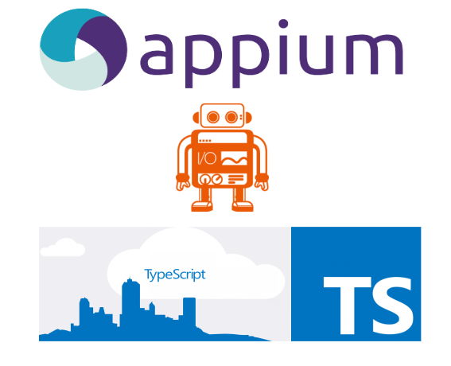
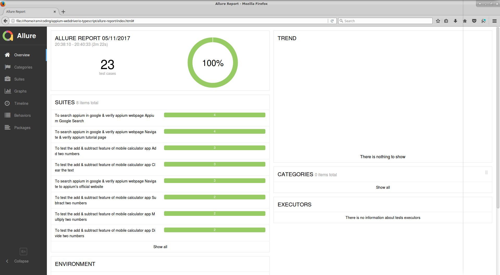
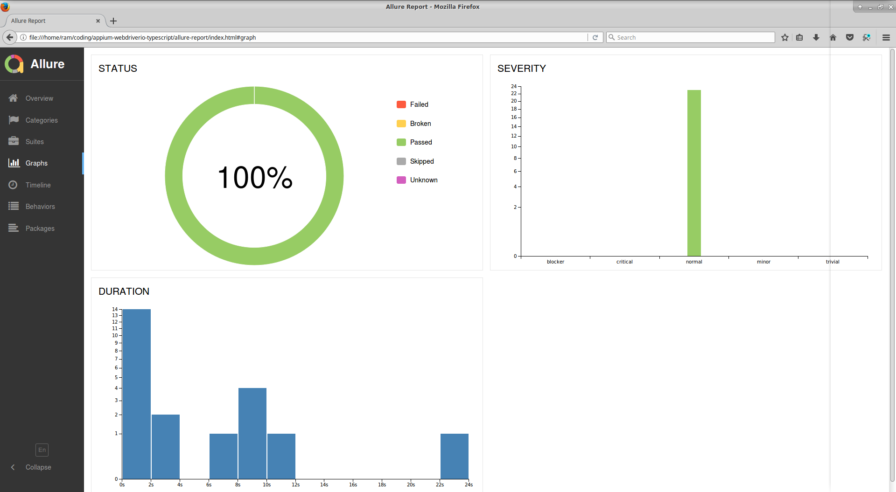

<p align="center">

</p>

<p align="center">
   <i><strong>Test framework for automating mobile apps with appium using webdriverio &amp; typescript!
</strong></i>
<p>

---

### <p align="center"> [About](#about) **|** [Getting Started](#getting-started) **|** [Installation](#installation) **|** [Writing Tests](#writing-tests) **|** [Page Objects](#page-objects) **|** [Finding Elements](#finding-elements) **|** [Reports](#reports)</p>

## About

Currently this framework has been developed to run scripts in **ANDROID** platform with real device.

The tests run both on **Android Native App** and **Mobile Browser**. Chrome browser is configured currently for running browser tests.

### Tech Stack

* [Appium]() - This is the node server which interacts with the mobile devices
* [WebdriverIO](http://webdriver.io/) - It is the selenium webdriver api bindings for node.js, It has a very simple api which could be used to automate web & browser apps in a fast and scalable way.
* [Typescript(Javascript)](https://www.typescriptlang.org/) - It is the superset of javascript which has additional static typings and features like JAVA and other languaes. Now you could write your code which compiles to pure javascript.
* [Cucumber](https://cucumber.io/) - The popular BDD test framework which helps us write automated tests. 

## Getting Started

### Pre-requisites

1. NodeJS installed globally in the system.
https://nodejs.org/en/download/

2.  JAVA(jdk) installed in the system.

3. Andriod(sdk) installed in the system.

4. Set **JAVA_HOME** & **ANDROID_HOME** paths correctly in the system.

5. Chrome browser installed.

6. Text Editor/IDE (Optional) installed-->Sublime/Visual Studio Code/Brackets.

**Tip:** Install `npm install -g appium-doctor` and run it from the command-line which checks if your java jdk and android sdk paths are set correctly or not.

## Installation

### Setup Scripts

* Clone the repository into a folder
* Go inside the folder and run following command from terminal/command prompt
```
npm install 
```
* All the dependencies from package.json and typescript typings would be installed in node_modules folder.

**Tip:** Use [**Yarn**](https://yarnpkg.com/en/docs/installing-dependencies)  to install your modules `npm install -g yarn` as it caches & locks them which would help us install correct versions of modules across various platforms without any issues. This project is configured with `yarn.lock` file. So you could make use of it.

### Run Tests

* First step is to start the `appium` server, This project includes the appium node module so you don't have to download it externally. You can run the appium server by the following npm command.

```
npm run appium
```
* Next you have to transpile/compile your typescript files to javascript files, you could do this by running the command -

```
npm run build
```

Next step is to execute the config files. This project has 2 config files -

* [wdio.app.config.js](./config/wdio.app.config.js) - This config file is used to run tests in real mobile native apps.
You would have to change the `appium settings` to run tests in your device.

```
capabilities: [
{
    appiumVersion: '1.7.1',                             // Appium module version
    browserName: '',                                   // browser name is empty for native apps
    platformName: 'Android',
    app: './app/LGCalculator.apk',                     // Path to the native app
    appPackage: 'com.android.calculator2',             // Package name of the app
    appActivity: 'com.android.calculator2.Calculator', // App activity of the app
    platformVersion: '5.1.1',                         // Android platform version of the device
    deviceName: 'THF755e0384',                       // device name of the mobile device
    waitforTimeout: waitforTimeout,
    commandTimeout: commandTimeout,
    newCommandTimeout: 30 * 60000,
}
],
```
To know your device name you could run the  `adb devices` command which comes out of the box from Android SDK.

The node command to run Native app tests of this project is - 

```
npm run app-test
```
The above command which is set in `package.json` internally calls the WebdriverIO's binary `wdio ./config/wdio.app.config.js`  and runs the app config file.

* [wdio.browser.config.js](./config/wdio.browser.config.js) - This config file is used to run tests in the chrome browser of the configured mobile device. The appium settings would looks like this-

```
capabilities: [
{
    appiumVersion: '1.7.1',
    browserName: 'chrome',  // browser name should be specified
    platformName: 'Android',
    platformVersion: '5.1.1',
    deviceName: 'THF755e0384', // device name is mandatory
    waitforTimeout: waitforTimeout,
    commandTimeout: commandTimeout,
    newCommandTimeout: 30 * 60000,
}
],
```

The node command to run browser tests of this project is - 

```
npm run browser-test
```
The above command internally calls the WebdriverIO's binary `wdio ./config/wdio.browser.config.js`  and runs the browser config file.

### Run Test Suite

You could run both the native app and browser tests by running the following command - 

```
npm test
```
The above command internally calls `npm run app-test` and `npm run browser-test`.

## Writing Tests

Cucumber framework has been integrated with thi project, WebdriverIO's `wdio-cucumber-framework` adapter helps write BDD style tests with Features & Step Definitions.

```
const {Given, When, Then} = require('cucumber');
import {expect} from 'chai';
import {CalculatorPageObject} from '../pages/calcPage';

const calc: CalculatorPageObject = new CalculatorPageObject();

Given(/^I am on my mobile calculator app$/, () => {
    const title = browser.getText('android.widget.TextView');
    expect(title).to.equal('Calculator');
});
```
## Page Objects

This framework is strictly written using page-object design pattern.

```
class GooglePageObject {
    public get searchTextBox(): any { return browser.element('#lst-ib'); }
    public get searchButton(): any { return browser.element('button[name="btnG"]'); }
    public get results(): any { return browser.waitForVisible('#rso', 5000); }
    public get firstLink(): any { return browser.element('#rso div._H1m._ees'); }
}
/*
Public Interface - export instances of classes
**/
export const GooglePage = new GooglePageObject()
```
## Finding-Elements

Finding elements in mobile apps and browser's could be tricky sometimes.

* Best way to find elements in native mobile apps is using [**UIAutomatorViewer**](https://developer.android.com/training/testing/ui-automator.html) .This supports Android 4.3 and above only, If you are using android version less than that, you could use [**Selendriod**](http://selendroid.io/)
* Best way to find elements in mobile browser is by ***Remote debugging with Chrome DevTools***.  I personally find it lot easier & hassle free. You could find detail steps about it in this [blog](http://toolsqa.com/mobile-automation/appium/inspect-elements-of-mobile-web-application/)

## Reports

Currently this project has been integrated with [Allure-Reports](http://allure.qatools.ru/). WebdriverIO's `wdio-allure-reporter` helps us generate detailed reports of our mobile automated tests.
Once the test execution is finished you would find the **allure-results** folder generated automatically. Then you would have to run the following command to generate **HTML Report**

```
npm run report
```

**Caveat:** Chrome browser has an issue rendering the AJAX requests from local files generated by allure, You could use **Firefox** for seeing the html report.
You could find more details about this issue [here](https://stackoverflow.com/questions/23997449/allure-report-nothing-shown-in-chrome)





## License
```   
MIT License

Copyright (c) 2017 Ram Pasala
```
